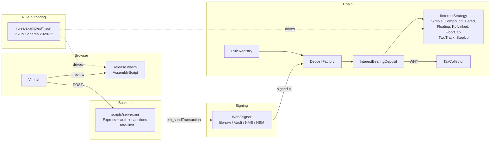

# paycodex-rules-poc

> Rule-driven interest-bearing deposits on EVM. The bank declares the rule as JSON, the customer previews accrual in the browser via WASM, and the bank's backend submits a transaction signed by HSM/Vault — never a customer wallet.

Hardhat · AssemblyScript WASM · Besu IBFT2 · Web3signer · Foundry · Slither.

[](https://codespaces.new/lopezpalacios/paycodex-rules-poc)
[](https://devpod.sh/open#https://github.com/lopezpalacios/paycodex-rules-poc)
[](https://scorecard.dev/viewer/?uri=github.com/lopezpalacios/paycodex-rules-poc)

Companion to [`paycodex`](../paycodex) (incumbent CH/EU/UK rails knowledge graph) and [`paycodex-onchain`](../paycodex-onchain) (DLT/EVM patterns knowledge graph).

## Devpod / Codespaces

Click any badge above and you get a working environment in minutes — Node 20, Foundry, Slither, solc-select, Docker-in-Docker, all preinstalled. The container's `postCreateCommand` runs `npm ci`, builds WASM, compiles contracts, and prints quick-demo commands.

```bash
# Once inside the container:
npm test                                   # 60+ Hardhat tests
npx hardhat deploy:all --with-pools        # 9 deposits + 9 pools in-memory
npm run besu:up && npm run server          # real chain + backend on ports 8545/3001
```

## Why this exists

Banks issuing tokenised deposits today face three frictions:

1. **Each rate variant is a code change.** New product = new contract = new audit cycle.
2. **Interest math drifts between systems.** Core banking, customer statement, and chain disagree at the basis-point level.
3. **Customer-facing demos ask for MetaMask.** Real bank UX never does.

This PoC fixes all three:

- Rules are **declarative JSON**. Same file drives the on-chain strategy AND the browser preview.
- WASM and Solidity are **parity-tested** at ≤ 0.01% (≤ 0.1% for compound) — they agree by construction.
- Backend signs via **Web3signer + HSM/Vault/KMS**. The browser never sees a wallet.

## Architecture



## Documentation index

| File | What it covers |
|---|---|
| [`DEPLOYMENT.md`](DEPLOYMENT.md) | Operator-side deployment guide — local dev, local Besu+UI, CI, production sketch + 11-item hardening checklist |
| [`SECURITY.md`](SECURITY.md) | Responsible-disclosure policy, severity SLAs, accepted PoC risks |
| [`docs/INCIDENT.md`](docs/INCIDENT.md) | Incident response runbook — 9 incident classes with concrete commands |
| [`MUTATION_TESTING.md`](MUTATION_TESTING.md) | Mutation-testing campaign workflow + survivor triage |
| [`EXECUTIVE-DECK.md`](EXECUTIVE-DECK.md) | 12-slide Marp deck for stakeholders (`marp EXECUTIVE-DECK.md --pptx`) |
| [`CONTRIBUTING.md`](CONTRIBUTING.md) | Local-dev workflow + adding a new rule |
| [`CHANGELOG.md`](CHANGELOG.md) | Per-iter change log (29+ iters) |
| [`RESULTS.md`](RESULTS.md) | Auto-regenerated gas-benchmark table |
| [`firefly/README.md`](firefly/README.md) | FireFly supernode migration plan (multi-bank consortium) |
| [`besu/README.md`](besu/README.md) | Single-validator Besu setup (per-PR E2E target) |
| [`besu/multivalidator/README.md`](besu/multivalidator/README.md) | 4-validator IBFT2 stack template (Besu version-blocked, see caveat) |
| [`besu/web3signer/README.md`](besu/web3signer/README.md) | Web3signer keystore + production swap (Vault / KMS / Azure / YubiHSM) |
| [`bruno/paycodex-rules-poc/README.md`](bruno/paycodex-rules-poc/README.md) | OSS Postman alt — 9 documented API requests, 2 environments |
| [`data/sanctions/README.md`](data/sanctions/README.md) | Sanctions-blocklist format + production wiring |

## Nine canonical rules

| # | Kind | Use case |
|---|---|---|
| 1 | Simple act/360 fixed | EUR demand deposit baseline |
| 2 | Compound daily 30/360 | Retail savings |
| 3 | Tiered balance bands | Corporate operating |
| 4 | Floating €STR + 50bps | Wholesale floating |
| 5 | KPI-adjusted ±100bps | ESG-linked |
| 6 | Floor 0% / cap 10% | Negative-rate protection |
| 7 | Two-track ECR/hard 50/50 | US-style commercial |
| 8 | CH 35% withholding | Verrechnungssteuer |
| 9 | Step-up coupon (3 steps) | Sustainability-linked bond |

Adding a 10th rule = 1 JSON file + 1 strategy contract + 1 parity test entry. Worked example: `iter 28` + `iter 29` in [CHANGELOG.md](CHANGELOG.md).

## Quick start

```bash
npm install
npm run wasm:build                                # asbuild → wasm/build/release.wasm
npm run compile                                   # hardhat compile
npm test                                          # 46 hardhat · forge test → 15 fuzz × 256 runs · npm run wasm:test → 18 WASM

# Pre-commit / pre-PR sanity check — runs every QA gate, prints green/red summary:
npm run healthcheck                               # full (slow: includes coverage + bench + ui:build)
npm run healthcheck:fast                          # fast (skips coverage/bench/ui:build)

# Simulate any rule client-side (no chain needed):
node scripts/simulate.mjs --rule rules/examples/09-step-up-bond.json --balance 1000000 --days 360

# Hardhat custom tasks (run `npx hardhat` to list all):
npx hardhat deploy:rule --rule rules/examples/01-simple-act360.json --network hardhat
npx hardhat deploy:all --network hardhat
npx hardhat compare:rule --rule rules/examples/01-simple-act360.json --balance 1000000 --days 360 --network hardhat
npx hardhat bench                                 # writes RESULTS.md
npx hardhat validate:rules                        # Ajv against schema
npx hardhat accounts --network besu               # list signers

# Spin up local Besu IBFT2 + Web3signer, then deploy onto it:
npm run besu:up
npx hardhat deploy:all --network besu             # via hardhat-config'd dev key
npx hardhat deploy:all --network besu-signer      # via Web3signer (no privkey in config)

# Backend server for wallet-less browser deploys (Web3signer signs):
npm run server &
npm run ui                                        # Vite + browser UI; pick "Backend (Web3signer, no wallet)" mode
```

### CLI reference

| Task | What it does |
|---|---|
| `deploy:rule --rule <path>` | Deploy strategy + register + create deposit for one rule |
| `deploy:all` | Reset deployments file + deploy core + 9 strategies + 9 deposits |
| `compare:rule --rule <path> [--balance N] [--days N]` | Run WASM preview, query on-chain `previewAccrual`, assert parity |
| `bench` | Run gas benchmarks for all 7 strategy kinds, write `RESULTS.md` |
| `validate:rules` | Ajv 2020 validate every `rules/examples/*.json` |
| `accounts` | List `eth_accounts` and balances on the current network |

### Verified results

- **Tests**: 46 Hardhat (unit + parity + revert + lifecycle + multisig + step-up) + 18 WASM + 15 Foundry-fuzz × 256 runs ≈ **3,584 random invariant checks per CI run**
- **Slither static analysis**: 0 findings
- **Solidity coverage**: 92.5% lines / 78% statements / 64% branches / 72% functions
- **Real Besu IBFT2 deploy**: all 9 rules registered + 9 deposits created via Web3signer (no privkey in config)
- **WASM ↔ Solidity parity**: ≤ 0.01% tolerance for 8 of 9 rules; ≤ 0.1% for compound (rpow vs Math.pow)
- **Production hardening**: 8 of 11 items closed in code — see [DEPLOYMENT.md §4.3](DEPLOYMENT.md#43-hardening-checklist)

### Gas (in-mem hardhat, paris target, optimizer=200)

| Strategy | previewAccrual | postInterest |
|---|---:|---:|
| simple    | 22,889 | 60,816 |
| compound  | 26,557 | 63,751 |
| tiered    | 29,752 | 66,307 |
| floating  | 28,343 | 65,180 |
| kpi-linked | 28,368 | 65,200 |
| two-track | 22,980 | 60,889 |
| step-up   | 42,742 | 71,843 |

Auto-regenerated by `npx hardhat bench` → [RESULTS.md](RESULTS.md). Note: `postInterest` includes the iter-16 `IMintable.mint()` step that mints gross interest from the bank's treasury before the WHT split.

## Layout

```
contracts/                    32 contracts (strategies, registry, factory, deposit, multisig, tax collector, mocks)
contracts/strategies/         9 IInterestStrategy implementations
contracts/lib/                DayCount, WadMath
contracts/interfaces/         IInterestStrategy, IRateOracle, IKpiOracle, ITaxCollector
rules/                        JSON Schema 2020-12 + 9 example rules
wasm/                         AssemblyScript module (browser-runnable preview)
test/                         5 hardhat .ts files + foundry/ fuzz suite
tasks/                        6 native Hardhat tasks (deploy:rule, deploy:all, compare:rule, bench, validate:rules, accounts)
scripts/                      server.mjs (Express+Web3signer), simulate.mjs (CLI WASM), sign-intent.mjs, mutation-test.sh, healthcheck.sh
ui/                           Vite + ethers — Backend mode (Web3signer) OR Wallet mode (MetaMask)
besu/                         single-validator IBFT2 docker-compose (per-PR E2E target)
besu/multivalidator/          4-validator template (Besu version caveat documented)
besu/web3signer/              Web3signer keystore (file-raw → swap to Vault/KMS in prod)
firefly/                      FireFly supernode migration plan + API definitions
bruno/                        OSS Postman alt — 9 documented API requests
data/sanctions/               Address blocklist (hot-reloadable)
docs/                         INCIDENT.md (runbook); src/+book/ generated by `forge doc`
.github/workflows/            5 CI jobs: slither, foundry-fuzz, build-test, besu-e2e, nightly mutation
DEPLOYMENT.md, SECURITY.md, EXECUTIVE-DECK.md, MUTATION_TESTING.md, RESULTS.md, CHANGELOG.md, CONTRIBUTING.md
```

## License

- **Code** (Solidity, TypeScript, AssemblyScript, shell) — [MIT](LICENSE)
- **Documentation** (markdown, slide decks) — CC-BY-SA-4.0
